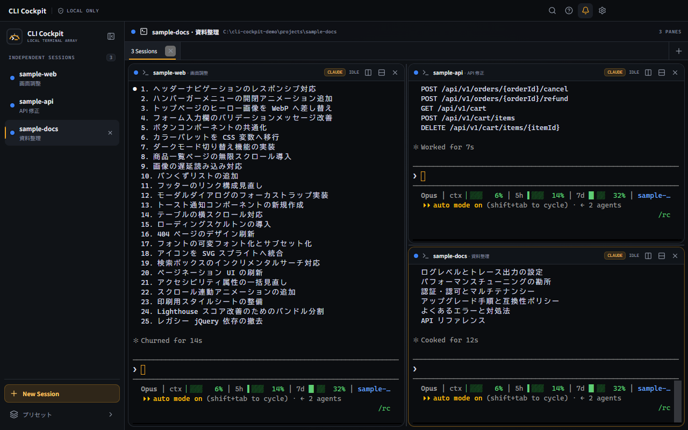
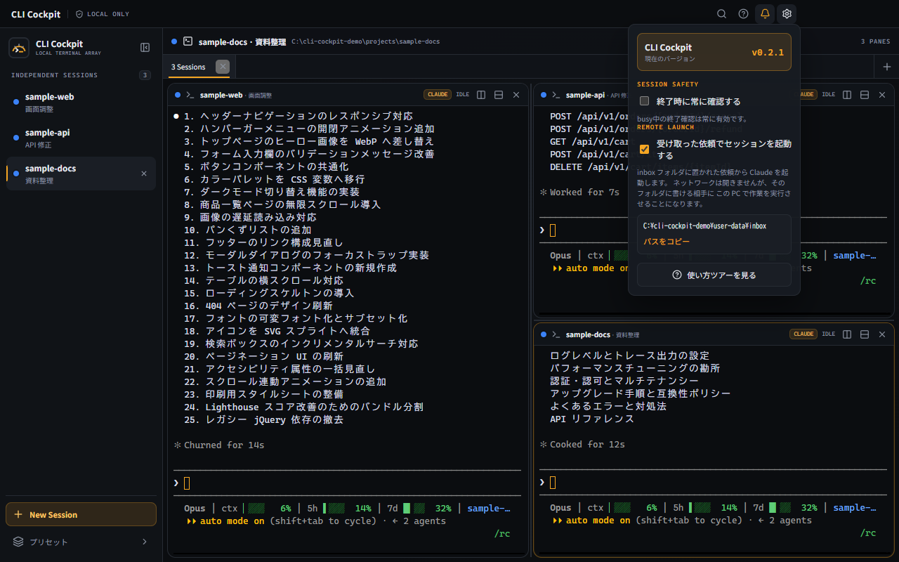
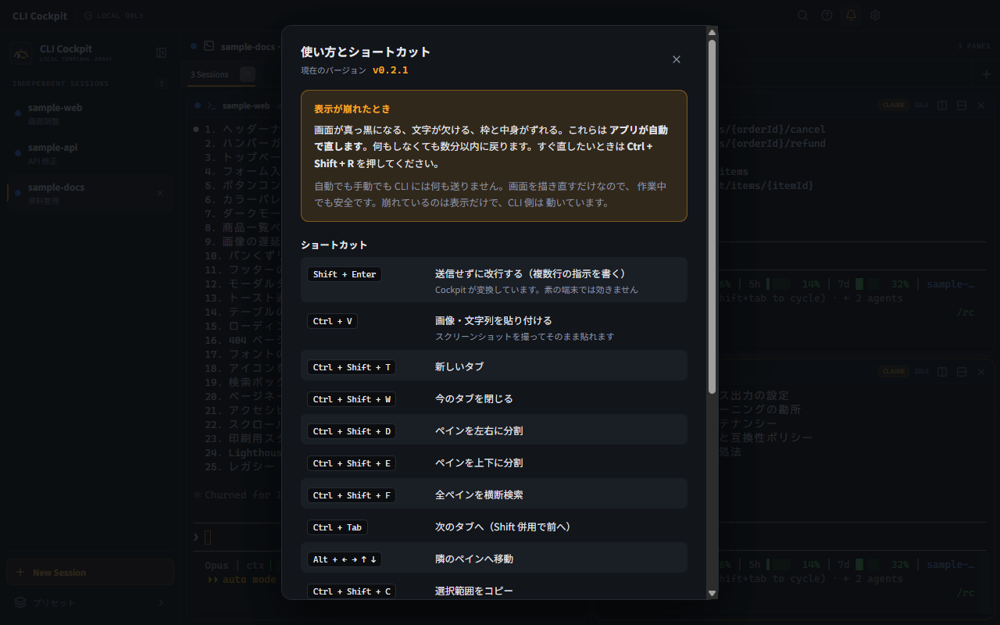

# AI Agent CLI Cockpit

日本語 · [English](https://github.com/quest-stack/ai-agent-cli-cockpit/blob/main/README.en.md)

Claude Code CLI と Codex CLI のセッションを、1つのウィンドウのタブとペインで
束ねる Windows 向けターミナルアプリです。

複数の AI CLI を同時に走らせていると、ターミナルの窓が案件の数だけ増えます。
どれがどの案件か分からなくなり、承認待ちで止まっているセッションを見落とし、
窓を探すだけで時間が溶けます。それを1つの画面にまとめます。



自社の業務で使うために作ったものを、そのまま公開しています。

---

## 目次

- [何ができるか](#何ができるか)
- [動かすために必要なもの](#動かすために必要なもの)
- [インストール](#インストール)
- [使いはじめる](#使いはじめる)
- [機能の説明](#機能の説明)
- [ショートカット一覧](#ショートカット一覧)
- [Windows で AI CLI を使うときの詰まりどころ](#windows-で-ai-cli-を使うときの詰まりどころ)
- [表示が崩れたとき](#表示が崩れたとき)
- [設定の保存先](#設定の保存先)
- [既知の制限](#既知の制限)
- [開発](#開発)
- [ライセンス](#ライセンス)

---

## 何ができるか

| したいこと | このアプリでどうなるか |
|---|---|
| 案件ごとに CLI を開きたい | フォルダと CLI を指定して起動。1セッション＝1プロセス |
| 複数を同時に見たい | 1つのタブを左右・上下に分割して並べる |
| 案件を切り替えたい | タブで切り替える。構成はそのまま残る |
| 承認待ちに気づきたい | セッション名の横のランプが赤くなり、Windows の通知も出る |
| 画面を CLI に見せたい | スクリーンショットを撮って `Ctrl` + `V` で貼るだけ |
| 前に出た内容を探したい | 開いている全ペインをまとめて検索する |
| 次の日も同じ配置で始めたい | 終了時のタブとペインの構成を復元する |

そして **Windows で AI CLI を使うときに詰まる箇所**を、アプリ側で吸収しています
（[詳細](#windows-で-ai-cli-を使うときの詰まりどころ)）。

- `Shift` + `Enter` で改行できる（素の Windows ターミナルでは効かない）
- 日本語入力の変換中に `Enter` を押しても、勝手に送信されない
- スクリーンショットを `Ctrl` + `V` で貼れる
- 文字コードが UTF-8 で揃うので、日本語が化けない

---

## 動かすために必要なもの

| 必要なもの | 確認方法 |
|---|---|
| Windows 11（ARM64 または x64） | 設定 > システム > バージョン情報 > システムの種類 |
| Node.js 22.12.0 以降 | PowerShell で `node --version` |
| Claude Code CLI | PowerShell で `claude --version` が通ること |
| Codex CLI（使う場合） | PowerShell で `codex --version` が通ること |

CLI 本体はこのアプリに含まれません。**先に各 CLI を入れて、PowerShell から
起動できる状態にしておいてください。**

---

## インストール

CPU に合うインストーラを選びます。

英語版は別ダウンロードです。アプリ内の言語切り替えはありません。英語版のファイル名には `-en-` が付きます。

| PC | ファイル |
|---|---|
| Intel / AMD 搭載 Windows | `CLI-Cockpit-<version>-win-x64.exe` |
| ARM 搭載 Windows | `CLI-Cockpit-<version>-win-arm64.exe` |
| Intel / AMD（英語版） | `CLI-Cockpit-<version>-en-win-x64.exe` |
| ARM（英語版） | `CLI-Cockpit-<version>-en-win-arm64.exe` |

どちらか分からない場合は、**設定 > システム > バージョン情報 > システムの種類**で
確認できます。「x64 ベース」と出れば x64、「ARM ベース」と出れば arm64 です。

インストーラは**コード署名をしていません**。実行すると Windows SmartScreen の
警告「WindowsによってPCが保護されました」が出ます。出所を確認できた場合に限り、
「詳細情報」→「実行」から進めてください。

ブラウザやクラウドストレージからダウンロードすると、ファイルに「ブロック」属性が
付いて起動できないことがあります。その場合はファイルを右クリック →「プロパティ」→
下部の「セキュリティ: 許可する」にチェック →「OK」で解除できます。

更新は手動です。新しい版のインストーラを実行してください（上書きで問題ありません）。
**設定・タブ・セッションは引き継がれます。**

---

## 使いはじめる

1. アプリを開くと、起動画面（ランチャー）が出ます
2. **プロジェクト**にフォルダを指定します
   - パスを直接入力する
   - `Browse…` でフォルダを選ぶ
   - 候補の一覧から選ぶ
3. **CLI** を選びます（`claude` / `codex` / `powershell`）
4. **セッション名**を入れます（省略すると CLI 名になります）
5. `Start Session` を押すと、そのフォルダで CLI が起動します

初回はプロジェクト候補が空です。候補は「よく使うフォルダを一覧に出しておく」ための
補助機能なので、**無くてもフォルダを指定すれば起動できます**。一度使ったフォルダは
履歴に残ります。

初回起動時は使い方ツアーが出ます。閉じたあとも、設定（歯車）の
「使い方ツアーを見る」から開き直せます。

---

## 機能の説明

### セッションとタブとペイン

3つの階層があります。

| 単位 | 意味 |
|---|---|
| **セッション** | 1つの CLI プロセス。フォルダと CLI の組み合わせ |
| **ペイン** | セッションを表示する枠。タブを分割して増やす |
| **タブ** | ペインのまとまり。案件ごとに分けると探しやすい |

**ペインの分割**は `Ctrl` + `Shift` + `D`（左右）と `Ctrl` + `Shift` + `E`（上下）です。
ペインの境界をドラッグすると比率を変えられます。`Alt` + 矢印キーで隣のペインへ移動します。

**タブの切り替え**は `Ctrl` + `Tab`（`Shift` 併用で逆順）です。

**ペインの一時最大化**は、分割中のペイン右上の最大化ボタン、または `Ctrl` + `Shift` + `Enter` で切り替えます。
もう一度押すと元の分割配置・比率に戻ります。非表示のセッションも動き続け、出力は保持されます。
最大化中に左の一覧から別のセッションを選ぶと、そのセッションへ表示が切り替わります。
分割の追加・ペインを閉じる操作では分割表示へ戻ります。最大化の状態は次回起動へ保存しません。

一覧・タブ・見出しは、案件や作業を表す**セッション名を先に表示**し、フォルダー名を補足にしています。
左の一覧では太字のセッション名をダブルクリックすると、その場で名前を変更できます。
複数セッションのタブは「選択中の作業名 · ほか2件」のように表示します。

左の一覧の × を押すと、起動中のセッションは入力待ち・待機中でも終了前に確認します。
「終了する」を選ぶと CLI の処理を止めて一覧から削除します。「キャンセル」または `Esc` で取り消せます。
初期選択は「キャンセル」なので、確認画面でそのまま `Enter` を押しても終了しません。
すでに終了したセッションは、確認なしで一覧から削除します。

タブを閉じるときも、中で CLI が動いていれば確認を求め、承認後にそのタブ内のプロセスを終了します。

### 状態ランプと通知

セッション名の横のランプで、いま何が起きているか分かります。

| 色 | 状態 | 意味 |
|---|---|---|
| 青 | 待機 | 入力を受け付けられる。指示を出してよい |
| 黄 | 作業中 | CLI が処理している。待つ |
| 赤 | 承認依頼 | CLI が確認を求めて止まっている。**操作が必要** |
| グレー | 終了 | セッションが正常に終了した |
| 濃い赤 | 異常終了 | セッションがエラーで落ちた |

**赤（承認依頼）になると Windows の通知でも知らせます。** 他のペインで作業していても
気づけるので、通知はオンのまま使うことを勧めます。タイトルバーのベルで切り替えられます。

### スクリーンショットを CLI に渡す

画面を撮って、ペインで `Ctrl` + `V` を押すだけです。

1. `Win` + `Shift` + `S` などで範囲を撮る（クリップボードに入る）
2. ペインをクリックして `Ctrl` + `V`

画像は一時ファイルとして保存され、そのパスが入力欄に入ります。あとは
「この画面のエラーを見て」などと続けて送れば、CLI が画像を読みます。

**Windows では CLI へ画像を直接貼れないことが多いため、この経路が要になります。**
文字列がクリップボードにある場合は、そのまま文字列として貼り付きます。

エクスプローラからファイルをペインへドロップすると、そのパスが入力されます。

### 横断検索

`Ctrl` + `Shift` + `F` で、**開いている全ペインの表示内容**をまとめて検索します。
「あのエラー、どのセッションで出たか」を探すときに使います。

### プロジェクトの候補・ピン留め・履歴

起動画面のフォルダ欄には、3種類の候補が出ます。

| 種類 | 説明 |
|---|---|
| **ピン留め** | 常に一覧の先頭に出る。フォルダ欄のピンアイコンで登録 |
| **履歴** | 一度使ったフォルダ。新しい順 |
| **スキャン** | 登録フォルダの直下1階層を走査して見つけたもの |

**作業フォルダの初期値は「最後に使ったフォルダ」です。** 毎回同じ場所で作業するなら、
そのまま `Start Session` を押すだけで済みます。

スキャン対象は `session.json` の `scanRoots` で設定します（[設定の保存先](#設定の保存先)）。
**案件そのものではなく、複数案件を含む1つ上のフォルダ**を指定してください。

```json
"scanRoots": ["C:\\work", "C:\\work\\clients"]
```

### セッションの復元

終了時のタブとペインの構成を保存し、次回起動時に**同じ配置で復元**します。
CLI も自動で起動し直します。

### リモート起動（既定は無効）

受付フォルダに置かれた依頼から、新しいタブで `claude` を起動する機能です。
外出中に手元の PC へ作業を始めさせておき、Claude Code の Remote Control で
続きをスマホやブラウザから触る、という使い方を想定しています。

**この機能は既定で無効です。** 使うには設定（歯車）の
「受け取った依頼でセッションを起動する」をオンにしてください。

オンにすると、依頼を置く受付フォルダの場所が同じ画面に出ます。



オンにしたうえで、次の場所に JSON ファイルを置きます。

```text
%APPDATA%\claude-cli-cockpit\inbox\<任意の名前>.json
```

```json
{
  "cwd": "C:/work/my-project",
  "title": "案件名",
  "prompt": "テストが落ちている原因を調べておいて"
}
```

`cwd` だけが必須です。`prompt` を書くと、CLI の起動後に最初の指示として送られます。
ファイルは処理された時点で削除されます。

**安全のために決めていること**

| 項目 | 内容 |
|---|---|
| 通信 | ネットワークのポートは開きません。ローカルのファイルを見に行くだけです |
| コマンド | 依頼側では選べません。常に `claude` を起動します |
| 指示文 | 改行やエスケープなどの制御文字を含む依頼は受け付けません |
| 作業フォルダ | 実在するフォルダでなければ起動しません |
| 記録 | 受理・不受理をすべて診断ログに残します |

**このフォルダに書き込める相手には、この PC で作業を実行させる力を渡すことに
なります。** 共用 PC など、書き込める相手を把握できない環境では有効にしないでください。

---

## ショートカット一覧

| キー | 動作 |
|---|---|
| `Shift` + `Enter` | CLI へ改行を送る（送信せずに複数行入力する） |
| `Ctrl` + `V` | 画像・文字列を貼り付ける |
| `Ctrl` + `C` | 上部ボタンで中断／コピーを切り替え。コピー時は未選択でも中断しない（設定を保存） |
| `Ctrl` + `Shift` + `C` | Ctrl+Cのモードにかかわらず選択範囲をコピー |
| `Ctrl` + `Shift` + `T` | 新しいタブ |
| `Ctrl` + `Shift` + `W` | 現在のタブを閉じる |
| `Ctrl` + `Shift` + `D` | ペインを左右に分割 |
| `Ctrl` + `Shift` + `E` | ペインを上下に分割 |
| `Ctrl` + `Shift` + `F` | 全ペインを横断検索 |
| `Ctrl` + `Shift` + `R` | 画面を描き直す（表示が崩れたとき） |
| `Ctrl` + `Tab` / `Ctrl` + `Shift` + `Tab` | 次 / 前のタブへ |
| `Alt` + `←` `→` `↑` `↓` | 隣のペインへ移動 |
| `F1` | 使い方とショートカットを表示 |

---

## Windows で AI CLI を使うときの詰まりどころ

素の Windows ターミナルで AI CLI を使うと引っかかる箇所を、アプリ側で吸収しています。

### `Shift` + `Enter` で改行できない

AI CLI に複数行の指示を書くとき、`Shift` + `Enter` で改行したくなります。しかし
Windows のターミナルは、`Shift` の有無にかかわらず `Enter` を「送信」として扱います。

このアプリは `Shift` + `Enter` を検出し、CLI が改行と解釈する制御シーケンス
（CSI-u 形式）に変換して送ります。**素の端末では効かない操作が使えます。**

### 日本語の変換中に `Enter` を押すと送信される

日本語入力で変換中に `Enter` を押すと、本来は「変換の確定」です。ところが端末には
それが伝わらず、確定と同時に送信されてしまいます。書きかけの文章が飛ぶことになります。

Windows の IME は変換中の `Shift` + `Enter` で **2回の入力イベント**を出します
（1回目は IME が確定に消費し、2回目が通常の `Enter`）。このアプリは両方を追跡して
端末へ渡さず、**変換の確定だけを行わせます。**

### 文字コードが揃わず日本語が化ける

Windows のコンソールは既定で日本語向けのレガシーな文字コードを使い、UTF-8 を前提と
する CLI と噛み合わずに文字化けします。

セッション起動時に、そのプロセス内だけ UTF-8 へ揃えてから CLI を起動します。
システム設定は変更しません。

### 画像を CLI に渡せない

Windows では CLI へ画像を直接貼り付けられないことが多く、AI にエラー画面を見せる手段が
ありません。クリップボードの画像を一時ファイルとして保存し、そのパスを入力欄へ渡すことで
解決しています。

### 一部の GPU で表示が崩れる

文字の描画に GPU を使うと、機種によっては表示が壊れることがあります。起動時に GPU を
判定し、問題が知られている構成では描画方法を自動で切り替えます。

---

## 表示が崩れたとき

画面が真っ黒になる、文字が欠ける、枠と中身がずれる。この症状は
**アプリが自動で直します**。何も操作しなくても数分以内に戻ります。

すぐ直したいときは `Ctrl` + `Shift` + `R` を押してください。その場で描き直します。

この案内とショートカット一覧は、アプリ内でも `F1` で開けます。



**CLI には何も送りません。** 画面を描き直すだけなので、作業中でも、CLI が処理中でも
安全です。崩れているのは表示だけで、CLI 側は正常に動いています。中身が消えたわけでは
ないので、慌てて閉じる必要はありません。

<!--
  根本原因は未確定。xterm.js のグリフ描画（WebGL）が、時間経過やレイアウト変更で
  実際の描画条件と噛み合わなくなることに由来する。

  0.1.7 で予防的な自動再描画を入れた（3分ごと・ウィンドウ復帰時）。redraw は CLI へ
  何も送らないため、崩れの有無を判定せず定期実行しても副作用がない。

  Qualcomm Adreno GPU + ANGLE(D3D11) では、複数の WebGL コンテキストを作った直後に
  既存ペインのテクスチャアトラスが壊れる実測例がある。WEBGL_debug_renderer_info を
  起動中に一度だけ読み、該当機では WebglAddon を読み込まず DOM renderer を使う。
  判定不能時は従来どおり WebGL を使い、cockpit.forceWebgl="1" で上書きできる。

  診断ログ11日分（手動回復27回）のうち26回は直前6秒間に CLI の入出力があり、
  放置時より操作中の発生が多い。効果測定: python scripts/analyze-redraw.py
-->

---

## 設定の保存先

タブ、セッション、ピン留め、最近使ったフォルダは次に保存されます。

```text
%APPDATA%\claude-cli-cockpit\session.json
```

このファイルを削除すると初期状態に戻ります。レイアウトが壊れて起動できなくなった
場合の逃げ道になります。

**テレメトリは行いません。** ワークスペースの状態は PC 内だけに保存します。
外部への通信は「新しい版が出ていないかの確認」だけで、**こちらから情報は送りません**。
確認に失敗してもアプリの動作には影響せず、オフラインでもそのまま使えます。

---

## 既知の制限

- **表示が崩れることがある**（真っ黒になる・文字が欠ける・枠とずれる）。
  アプリが自動で直すが、直るまで最大3分かかる。すぐ直したいときは
  `Ctrl` + `Shift` + `R`。根本原因は未確定で、現状は自動再描画で症状を抑えている
- インストーラは未署名のため、初回実行時に SmartScreen の警告が出る
- 更新は自動では入らない。インストーラの実行は手動
- **Windows 専用**。macOS / Linux では動作しない
- 日本語入力の変換中表示は、xterm.js 側の制約を独自に補正している。表示の乱れを
  見つけたら、操作手順とあわせて報告してほしい

---

## 開発

```powershell
npm install
npm run typecheck
npm run lint
npm run test:unit
npm run build
```

起動するには次を実行します。

```powershell
npm run dev
```

ネイティブモジュールを再構築する必要がある場合は次を実行します。実行 PC の
アーキテクチャを使うため、ARM64 に固定されていません。

```powershell
npm run rebuild:native
```

インストーラを作るには次を実行します。`package:all` は ARM64 版と x64 版を
まとめて生成します。成果物は `release/` に出力されます。

```powershell
npm run package:arm64
npm run package:x64
npm run package:all
```

構成は Electron + xterm.js + React + Vite です。TypeScript で書かれており、
`src/electron`（メインプロセス）、`src/renderer`（画面）、`src/shared`（共通）に
分かれています。

0.2.8以降の日英両版は次のコマンドで作ります。言語をビルド時に固定し、既存の配布物を消さずに `release/<version>/<ja|en>/` へ出力します。

```powershell
npm run build:editions
npm run package:editions
# 英語・x64だけ作る場合
npm run package:editions -- --language=en --arch=x64
```

---

## ライセンス

MIT License です。詳細は [LICENSE](LICENSE) を参照してください。

商用・非商用を問わず、自由に使用・改変・再配布できます。条件は
「著作権表示とライセンス本文を残すこと」だけです。無保証で提供しており、
このソフトウェアの利用によって生じた損害について作者は責任を負いません。

利用しているオープンソースソフトウェアのライセンスは
[THIRD-PARTY-NOTICES.md](THIRD-PARTY-NOTICES.md) にまとめています。
インストール後は `resources` フォルダ内にも同じものが入っています。
Electron と Chromium のライセンスは、インストール先の
`LICENSE.electron.txt` / `LICENSES.chromium.html` にあります。

## 不具合の報告と機能の要望

自社の業務で使うために作ったツールを、そのまま公開しています。
**機能の要望には原則として対応しません。** 不具合の報告はありがたく拝見しますが、
対応をお約束はできません（内容と状況によって判断します）。

自分で直したい場合は、MIT ライセンスなので自由にフォークしてください。
